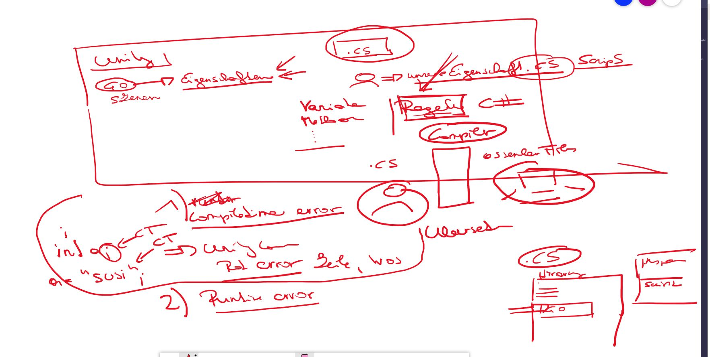

# Tutorial09112020

### Project description: 
Uebung von C# Begriffen, Klassen deklaration, Methoden deklaration, namespaces, Debug.Log, unterschied return type void und anderer Datentyp (int, string).

### Development platform: 
Windows 10, Unity 2020.1.5f1, VS Community 2019

### Target platform: 
None

### Visuals: 
Screenshots (concept and experience), Video

### Necessary setup/execution steps: 
Installation process, e.g. step by step instructions that I can run the project after cloning it

### Third party material: 
(if used Fonts, Sounds, Music, Graphics, Materials, Code etc.)

### Project state: 
incl. progress in percent

### Limitations: 

### Lessons Learned: 

Copyright by smeerws
